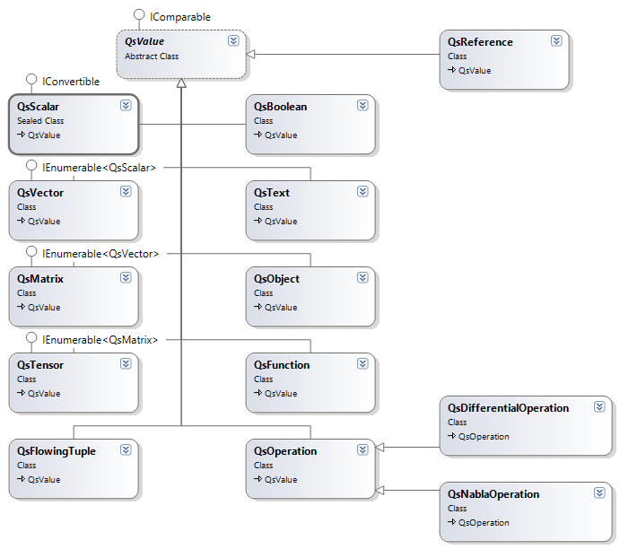
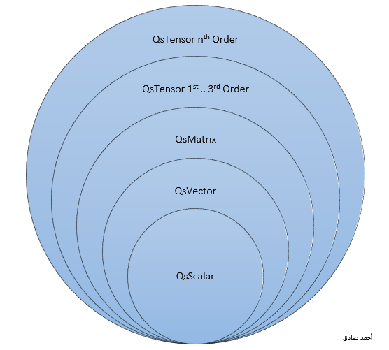

Runtime Types
=============
All the runtime types are inherited from the `QsValue` reference type. 
These types has gone through a careful architecture to describe the sematics of the language elements.

The following class diagram illustrate how these types are related to the `QsValue`. After this diagram a breif discussion for each type is illustrated for the reader to follow what the runtime is capable of.

Mathematical Types
------------------
Mathematical Types are those types that shape the algebraic operations in the runtime.

These mathematical types includes Scalars, Vectors, Matrices, and Tensors.

The relation between these types can be show in the next figure.

The explanation of these types comes in subsequent chapters.

#. Making a Scalar Value obeys the format `variable = value<unit>`::

	Qs> a = 5<kg> 
	    Mass: 5 kg
	Qs> b = 6<slug>
	    Mass: 6 slug
	Qs> a+b
	    Mass: 92.563421551991 kg

#. Making a vector value obeys the format `variable = {scalar scalar ... scalars}`::

	Qs> v = {3<m> 4<m> 5<m>}
	    QsVector: 3<m> 4<m> 5<m>
	Qs> _||v||_								#This is the vector magnitude
	    Length: 7.07106781186548 <m>

#. Matrix values looks like the matrix declaration in matlab but units aware:: 

	Qs> m = [10<in> 20<mm> 30<ft>; 5<fur> 30<m> 400<cm>; 60<in> 5<mil> 6<Mm>]
	    QsMatrix:
	      10<in>        20<mm>        30<ft>
	      5<fur>         30<m>       400<cm>
	      60<in>        5<mil>         6<Mm>
	Qs> _|m|_								#This is the determinant of matrix
	    Volume: -38.6016990720004 <in.km^2>
	Qs> 0<m^3> + _|m|_					#To convert the value into cubic meters
	    Volume: -980483.156428811 <m^3>

#. Tensors declaration in the runtime are valid up to any higher dimensions
   Tensor declaration depends on a recursive mechanism in writing the values which implies that 
   Tensor of Rank N can contain many tensors of Rank N-1::

	# Vectors
	a = {4 3 2}
	b = {3 2 7}
	c = {5 3 1}

	# Tensors from zero rank to 4th rank
	T0 = <| 3 |>
	T1 = <| a b |>
	T2 = <| a ;b ; c|>
	T3 = <| a;b;c | b;c;a | c;a;b |>
	T4 = <| T3 | T3*2 |>

QsBoolean
---------
This is a True, and False values .. However this type was introduced recently in the runtime and most of comparison statements still use the System.Boolean type.

it worth to mention also that operations on boolean values are also implemented::

	Qs> true + false
	    True
	Qs> true * false
	    False

QsText
------
Any text that is written between \"\" is considered a QsText type.
Shifting is available in QsText  shifting with right and left operators that looks like C operators::

	Qs> name = "Ahmed Sadek"
	    Ahmed Sadek
	Qs> name >> 4
	    adekAhmed S
	Qs> name << 5
	    SadekAhmed

Applying indexer to the QsText result in getting the text separated by lines.

QsFunction
----------
Defining a function is a corner stone in the runtime, to define the function you simply write `f(x) = expression`:: 
	
	Qs> f(x) = x^2
	Qs> f(7)
	    49

QsObject
--------
Special type for dealing with CLR objects.

QsReference
-----------
The reference type is a value that reference another value. It was created during the discussions of **rvalues** in C++ ISO C++ 11 specifications.
Example::

	Qs> P=35
	    DimensionlessQuantity: 35 <1>
	Qs> &PR = P
	    P: DimensionlessQuantity: 35 <1>
	Qs> PR = "hello there"
	    P: hello there

The declaration of reference varaiable requires to preceded `&` similar to C++ references before the variable name.
changing the reference value variable only changes the referenced value.

QsOperation
-----------
This is a base class for currenlty two implemented operations Differential and Nabla Operations. 

The implemented operations are stored in the QsScalar class with an operation type that carried out during calculations to obtain specific techniques.

QsFlowingTuple
--------------
This is the tuple implementation in the runtime. The tuple is declared with between two brackets with more than one value
and can contain any of the types mentioned in here beside itself.

Following is the declaration example of the tuple::

	Qs> T = (40,80<kg>, (3,4,5), "hello there", @|$x)
	    FlowingTuple (40<1>, 80<kg>, QsTuple[3 Elements], "hello there", @|x)
	Qs>

 
