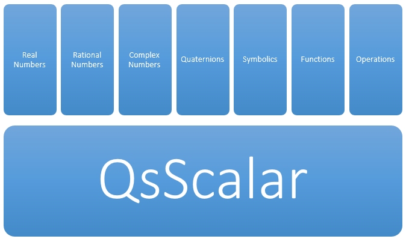

Scalars Types
=============

Scalar quantitiy can be instantiated by simply typing `variable = value<unit>`  if you omit the unit part then the quantity is dimensionless quantity.

The scalar quantity has 6 sub-types of values that is supported in quantity system as a first citizen.

Real Numbers
------------
Declaring a real number is the most forward  just type `variable = value`

Rational Numbers
----------------
Raional numbers contain a numerator and denominator part .. this can be acheived by typing `Q{numerator denominator}`
In a music misura of 4/4 Example::

	ronde   = Q{4 4}
	blanche = Q{2 4}
	noire   = Q{1 4}
	croche  = noire / 2  # gives you DimensionlessQuantity: (1/8) <1>
	dcroche = croche /2  # gives (1/16)

Complex Numbers
---------------
Complex numbers contains a real part and an imaginary part .. this can be acheived by typing `C{real imaginary}`.
Example::

	Qs> C{3 2} / C{4 -5}
		DimensionlessQuantity: (0.0487804878048781, 0.560975609756098i) <1>
	Qs>

Quaternions
-----------
Quaternions are also supported and its prefix is `H`. The quaternion has a real number and three additional numbers i,j, and k.

Example:: 
	
	Qs> H{4 3 2 1}
		DimensionlessQuantity: (4, 3i, 2j, 1k ) <1>
	Qs>

Additional feature of quaternion that used in 3D programmign is to get the rotation matrix representation of the quaternion value
this can be acheived by calling the RotationMatrix property of the quaternion::

	Qs> rm = H{4 3 2 1}->RotationMatrix
		QsMatrix:
			-9<1>          4<1>         22<1>
			20<1>        -19<1>        -20<1>
		   -10<1>         28<1>        -25<1>

	Qs>

Symbolics
---------
In quantity system .. symbolic values can be declared and treated like any other value.  Symbolic values can be declared with `$` prefix.
There are two ways to declare the symbolic value. First one is to write `$` preceded with any letters and this will be considered a simple symbolic value
Example::

	Qs> a = $a
	Qs> b = $b
	Qs> c = $vax

Second method is to enclose a symbolic value expression between brackets as shown before in the case of rational, and quaternion subtypes.

Exmaple::

	Qs> a = ${a+b}
	Qs> a^6      
	    DimensionlessQuantity: a^6+6*b*a^5+15*b^2*a^4+20*b^3*a^3+15*b^4*a^2+6*b^5*a+b^6 <1>
	

Functions
---------
An important feature in quantity system is the ability to treat the functions as if they are variables.
Declaring Scalar Functions can be made by two ways.

#. Referring to an existing function by preceding it with `@`::
	
	Qs> f(x,y) = x^2+y^4-5
	Qs> my_f = @f(x,y)
		DimensionlessQuantity: f(x,y) = x^2+y^2 <1>
	Qs>

#. Declaring the function anonymously inline::

	Qs> my_f = @{(x,y)=x^2+y^4-5}

Functions acting as a scalar value can be also be called like real functions by invoking indexing
typing `my_f[3,5]` will get the required result.

Operations
----------
Another unique scalar sub-type is being the operation type.  This type defines and operation that can take action into calculations
currently the operation introduced is the differentiation operation.

differentiation operation starts with `@|` followed by the variables that we wish to differentiate with respect to.

for example to declare a differentiation operation for variable *x* we write `@|$x`  and if we want to differentiate for *x* then for *y* 
we write `@|$x|$y`

Exmaple::
	
	Qs> my_o = @|$x
		@|x
	Qs> f(x) = x^3
	Qs> j = my_o * @f(x)   # this is equivalent to  @|$x * {(x)=x^3}
		DimensionlessQuantity: _(x) = 3*x^2 <1>

Another operator is the del operator `\/` 

